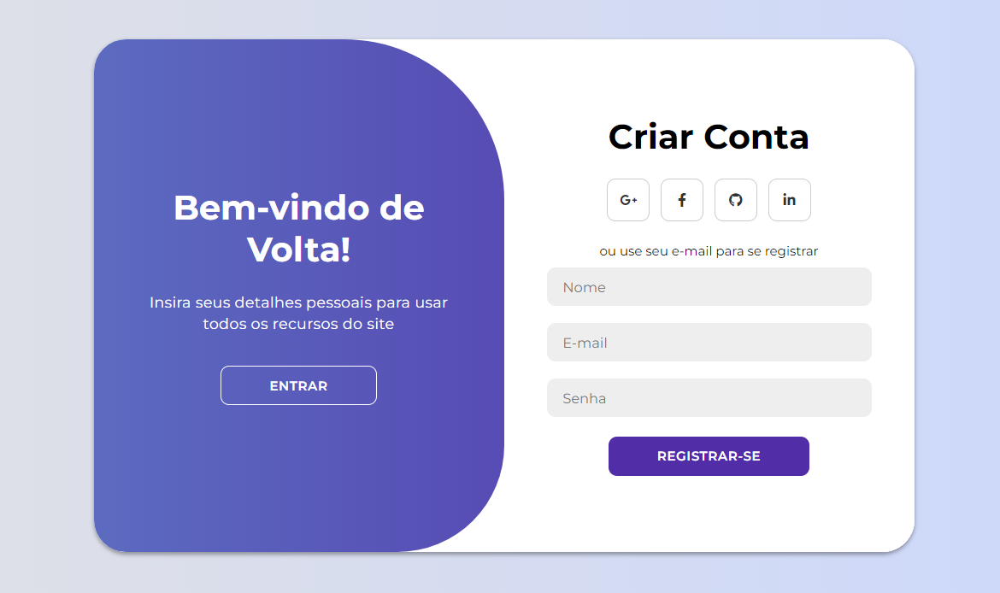
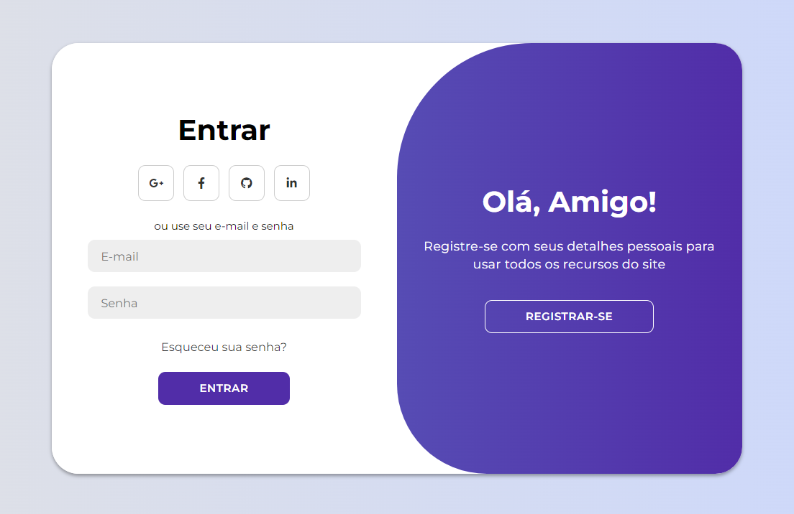

fiz este projeto com esse tutorial ([Open in Youtube](https://youtu.be/PlpM2LJWu-s)), usando HTML, CSS e JavaScript modernos para criar um design completo de página de login com animações de login e inscrição. Vamos utilizar o CSS Flexbox, transição CSS para alguns efeitos de animação interessantes e também keyframes CSS! recomendo para quem quiser aprender algumas tecnicas 

